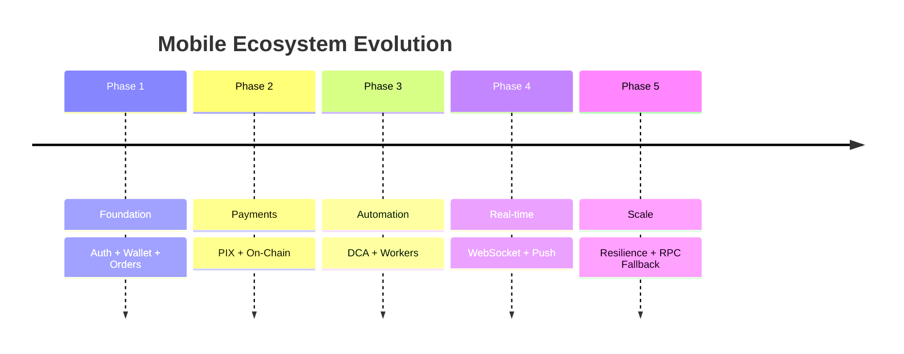

# Financial Product Interface

<div align="center">
  
</div>

---

## 📱 ChainFx - Instant PIX to Stablecoin Payments

**ChainFx** é uma plataforma Web3 que permite comprar e vender stablecoins como USDT (Tether.io) e EURUSD (Digital Euro Dollar) de forma instantânea e segura. Com integração via PIX, você pode realizar transações em segundos com total confiabilidade.

### ✨ Diferenciais da Plataforma

- ⚡ **Compre e venda cripto instantaneamente** via PIX
- 🔒 **Transações seguras** e sem complicações
- 👥 **950.000+ usuários** confiam na ChainFx
- 💳 **30+ opções** de pagamento locais
- 🪙 **100+ criptomoedas** disponíveis

---

## 🛒 Fluxo de Compra (Buy) - Step 1

### Informe o valor e visualize a cotação

<div align="center">
  
</div>

**Como funciona:**

1. Selecione a moeda que deseja pagar (BRL)
2. Informe o valor que deseja comprar
3. Visualize a cotação atualizada em tempo real
4. Confirme a quantidade de cripto que irá receber

---

## 💳 Fluxo de Pagamento - Step 2

### Insira sua wallet e escolha o método de pagamento

<div align="center">
  
</div>

**Como funciona:**

1. **Informe sua Wallet** - Cole o endereço da sua carteira (ETH, BTC, USDT)
2. **Escolha o método de pagamento**:
   - 💰 **PIX** - Instantâneo e sem taxas extras
   - 💳 **VISA** - Cartão de crédito internacional
   - 💳 **Mastercard** - Cartão de crédito internacional
3. **Confirme a transação** e receba suas criptos em segundos

---

## 💳 Fluxo de Pagamento - Step 3 (PIX)

### Escaneie o QR Code e confirme o pagamento

<div align="center">
  
</div>

**Como funciona:**

1. **Escaneie o QR Code** - Utilize o app do seu banco para escanear o código PIX
2. **Copie o código PIX** - Caso prefira, copie o código e cole no seu banco
3. **Confirme o pagamento** - Realize o pagamento no valor exibido
4. **Receba suas criptos** - Após a confirmação do pagamento, suas criptos serão entregues em segundos

---

## 💳 Fluxo de Pagamento - Step 3 (Cartão de Crédito - Stripe)

### Integração em andamento!

<div align="center">
  
</div>

**Pagamento com cartão via Stripe estará disponível em breve.**

- 💳 **VISA** - Cartão de crédito internacional
- 💳 **Mastercard** - Cartão de crédito internacional

*Por enquanto, utilize PIX para compras instantâneas.*


## 🔄 Fluxo de Venda (Sell)

### Venda suas criptos e receba em reais

1. Selecione a criptomoeda que deseja vender
2. Informe a quantidade
3. Escolha o método de recebimento (PIX)
4. Confirme a transação e receba em sua conta

---


# ChainFx Payment Gateway

Backend Go para orquestracao instantanea de settlement fiat -> USDT.

ChainFx opera como um **instant settlement orchestration system**: recebe fiat por rails tradicionais, confirma o pagamento, registra tudo de forma auditavel e dispara entrega cripto para a wallet do usuario.

## Indice

1. [Sobre o ChainFx](#sobre-o-ChainFx)
2. [Fluxo do Cliente](#fluxo-do-cliente)
3. [Principais Capacidades](#principais-capacidades)
4. [Arquitetura Tecnica](#arquitetura-tecnica)
5. [Deploy](#deploy)
6. [Documentacao Tecnica](#documentacao-tecnica)
7. [Licenca](#licenca)

## Sobre o ChainFx

ChainFx permite comprar e vender stablecoins como USDT de forma rapida, com integracao via PIX e entrega cripto para wallet BSC.

Principais diferenciais:

- Compra de USDT via PIX.
- Cotacao travada por janela configuravel.
- Webhook de pagamento com HMAC.
- Delivery cripto assinado por signer isolado.
- Auditoria por ordem, request ID, provider ID e hash on-chain.
- LGPD por minimizacao, hash e criptografia AES-GCM nos dados sensiveis de SELL.

## Fluxo do Cliente

### BUY BRL via Pix

1. Usuario informa quanto quer pagar em BRL.
2. API retorna cotacao e quantidade estimada de USDT.
3. Usuario informa wallet BSC.
4. Gateway cria `buy_order` em `aguardando_pix`.
5. Cliente paga o PIX.
6. Webhook bancario confirma pagamento.
7. Gateway marca `pago_fiat`.
8. `BuySendWorker` entrega USDT para a wallet do cliente.
9. Ordem recebe `tx_hash_out` e `delivered_at`.

Fluxo esperado:

```text
Cliente paga Pix -> Webhook confirma -> BuySendWorker dispara da wallet ChainFx -> USDT chega na wallet do cliente
```

### SELL USDT -> Pix

1. Usuario informa chave PIX e valor BRL.
2. Gateway gera endereco de deposito BSC deterministico.
3. Monitor on-chain confirma deposito USDT.
4. `PayoutWorker` liquida PIX para o usuario.

## Principais Capacidades

- API publica em `cmd/api`.
- Workers concorrentes em `internal/workers`.
- Persistencia PostgreSQL em `internal/database`.
- Webhooks PIX e Stripe com idempotencia.
- SSE para acompanhamento de status.
- Healthcheck `/healthz` e readiness `/readyz`.
- Benchmark do fluxo PIX -> delivery em `cmd/benchflow`.
- Deploy por `Dockerfile` e `railway.json`.

## ChainFX Developers API

ChainFX posiciona o gateway como **Digital FX Payments Infrastructure**:

```text
PIX -> ChainFX API -> USDT na wallet
USDT -> ChainFX API -> PIX BRL na conta
```

### Status tecnico

Implementado neste repositorio:

- Fase 1: API REST, webhooks basicos, sandbox operacional e documentacao inicial.
- Fase 2: Developer Dashboard, API keys, logs operacionais e retry de webhook.
- Fase 3: SDK Node, SDK Python, OpenAPI e exemplos de integracao.
- Fase 4: MCP server, OpenAI Agents, webhooks n8n/Zapier/Make e retry system com fila e backoff.

Planejado para integracao futura:

- Fase 5: expansao de assets, paises e rails adicionais.

Nao faz parte do escopo atual:

- Bridge entre redes.
- Pool, AMM, DEX, LP ou yield.
- Custodia multi-chain complexa fora do fluxo PIX <> stablecoin.

### API REST

Endpoints principais implementados:

- `GET /rates`
- `POST /quote`
- `POST /buy`
- `POST /sell`
- `GET /order/{id}`
- `POST /webhooks/test`
- `POST /webhooks/retry`
- `GET /developers/dashboard`
- `GET /developers/logs`
- `GET /developers/api-keys`
- `GET /openapi.json`

### Autenticacao

```http
Authorization: Bearer sk_live_xxx
```

Modelo de keys:

- Public test: `pk_test_xxx`
- Secret test: `sk_test_xxx`
- Public live: `pk_live_xxx`
- Secret live: `sk_live_xxx`

As chamadas server-to-server usam secret key no header `Authorization`. Public keys ficam reservadas para futuras experiencias client-side ou identificacao publica.

### Webhooks

Eventos documentados:

- `payment.created`
- `payment.completed`
- `payment.failed`
- `order.confirmed`
- `crypto.sent`
- `crypto.confirmed`
- `order.failed`

Payload padrao:

```json
{
  "event": "payment.completed",
  "orderId": "ord_123",
  "status": "paid",
  "asset": "USDT",
  "amount": "96.52",
  "timestamp": "2026-07-04T00:00:00Z"
}
```

Retry tecnico:

- `POST /webhooks/retry` reconstrui o payload de uma ordem existente.
- Se `targetUrl` for informado, o gateway faz um `POST` real para a URL.
- A entrega inclui `X-ChainFX-Event` e `X-ChainFX-Signature`.

### Sandbox

O ambiente sandbox fica separado conceitualmente em:

```text
https://sandbox-api.chainfx.com
```

No desenvolvimento local, use:

```text
http://localhost:8080
```

Recursos previstos/implementados no modo sandbox:

- PIX fake.
- QR fake.
- wallet fake.
- webhooks simulados.
- ordens de teste.
- API keys test.

### Developer Dashboard

Rotas operacionais:

- `/developers`
- `/developers/dashboard`
- `/developers/logs`
- `/developers/api-keys`

O dashboard mostra API keys mascaradas, logs recentes de `order_events` e `buy_order_events`, e instrui o retry de webhook.

### Artefatos da Fase 3

- Node SDK: `sdk/node`
- Python SDK: `sdk/python`
- OpenAPI estatico: `docs/openapi/chainfx.openapi.json`
- Exemplos Node: `examples/node`
- Exemplos Python: `examples/python`

### Exemplo Node

```js
import { ChainFX } from "./sdk/node/index.js";

const chainfx = new ChainFX({
  apiKey: process.env.CHAINFX_API_KEY,
  baseUrl: process.env.CHAINFX_API_BASE_URL || "https://sandbox-api.chainfx.com"
});

const order = await chainfx.buy({
  fiat: "BRL",
  asset: "USDT",
  amount: 500,
  wallet: "0x000000000000000000000000000000000000dEaD",
  customer: {
    name: "Maria Silva",
    email: "maria@example.com",
    cpf: "12345678909",
    phone: "11999999999",
    birthDate: "1990-05-20",
    address: {
      line1: "Av Paulista",
      number: "1000",
      city: "Sao Paulo",
      state: "SP",
      postalCode: "01310100",
      country: "BR"
    }
  }
});
```

Como o fluxo de compra por API funciona:

1. O dev envia `POST /buy` com valor, asset, wallet e dados do comprador.
2. O backend cria uma `buy_order` com `id/buyId` e `accessToken`.
3. O backend envia os dados do comprador e o valor para o PagBank para gerar a cobranca PIX.
4. A resposta retorna `qrCodeUrl`, `pixKey`, `payment`, `orderUrl` e `statusUrl`.
5. O sistema do dev renderiza o QR Code ou apresenta o payload PIX ao pagador.
6. Quando o usuario paga, o webhook PagBank chama o backend.
7. O backend marca a compra como paga.
8. O worker de entrega envia USDT para a wallet informada.
9. O dev acompanha por `GET /order/{id}?accessToken=...` ou webhooks.

Campos de comprador aceitos hoje em `/buy`:

- `customer.name`
- `customer.email`
- `customer.cpf`
- `customer.phone`
- `customer.birthDate`
- `customer.address`

Esses campos sao enviados ao provider de pagamento quando disponiveis. Para auditoria local, o backend guarda hashes/minimizacao e nao precisa manter PII completa em claro.

### Exemplo Python

```python
from chainfx import ChainFX

chainfx = ChainFX(api_key="sk_test_chainfx_local", base_url="http://localhost:8080")
quote = chainfx.quote(side="buy", fiat="BRL", asset="USDT", amount=500)
```

### Roadmap futuro

Fase 4 integrada com foco em automacao e IA:

- MCP server (`/mcp/initialize`, `/mcp/tools/*`, `/mcp/resources/*`, `/mcp/prompts/list`).
- OpenAI Agents (`/api/agents/*`): analise de mercado, recomendacao, deteccao de anomalias, previsao de preco, resumo de transacoes.
- Webhooks de automacao n8n/Zapier/Make (`/api/webhooks/subscriptions`), com fila de retry, backoff, registro e logs de entrega.

Fase 5 sera integrada futuramente com foco em expansao operacional:

- mais assets alem de USDT;
- mais paises;
- mais rails locais;
- limites e compliance por mercado;
- SDKs adicionais como Go e PHP.

## Segurança de Custódia com EIP-7702

O signer Go inclui uma camada opcional de proteção de custódia baseada em EIP-7702. O objetivo não é executar arbitragem nem alterar o fluxo PIX, mas proteger a hot wallet contra delegações inesperadas de conta EOA.

O EIP-7702 introduz transações `SET_CODE` (`type 0x04`) com `authorizationList`, permitindo que uma EOA autorize temporariamente/de forma controlada a execução de código delegado. Isso é poderoso para account abstraction, batching e session keys, mas também cria um novo risco operacional: se a hot wallet autorizar um delegate desconhecido ou comprometido, a custódia pode ser afetada.

Por isso o signer tem um `CustodyGuard`:

```text
Signer monitora pending/latest blocks
-> detecta transações EIP-7702 type 0x04
-> lê authorizationList
-> recupera a authority/wallet que assinou a autorização
-> se a authority for uma wallet protegida e o delegate não estiver na allowlist:
   signer entra em lockdown
   /hd/transfer deixa de assinar novas saídas
```

Configuração opcional no serviço do signer:

```env
CUSTODY_GUARD_ENABLED=true
CUSTODY_GUARD_POLL_MS=1500
CUSTODY_TRUSTED_DELEGATES=
CUSTODY_ALLOWED_SELECTORS=
CUSTODY_PROTECTED_WALLETS=
```

A hot wallet derivada de `EVM_PRIVATE_KEY` entra automaticamente na lista protegida. `CUSTODY_PROTECTED_WALLETS` serve para adicionar outras carteiras. `CUSTODY_TRUSTED_DELEGATES` deve conter somente contratos auditados e esperados. Se o bytecode de um delegate confiável mudar ou surgir delegate desconhecido, o signer bloqueia a assinatura até intervenção operacional.

## Custodia Operacional em Producao

O `CustodyGuard` fica no servico do signer, nao no fluxo PIX. O PIX continua sendo a entrada de pagamento do cliente; a protecao atua no caixa, hot wallet, treasury e assinatura on-chain.

```text
Cliente paga PIX
        |
Gateway confirma ordem
        |
Core solicita liquidacao ao signer
        |
CustodyGuard valida risco, nonce, limites e lifecycle
        |
Signer assina e envia token on-chain
```

### Protecao EIP-7702

O signer monitora blocos `pending` e `latest` nos RPCs configurados. Quando encontra uma transacao EIP-7702 (`SET_CODE`, type `0x04`), ele:

- le a `authorizationList`;
- recupera a `authority`, que e a wallet que assinou a autorizacao;
- verifica se a wallet esta protegida;
- valida se o delegate esta em `CUSTODY_TRUSTED_DELEGATES`;
- valida selector permitido, se `CUSTODY_ALLOWED_SELECTORS` estiver configurado;
- confere se o bytecode hash do delegate confiavel nao mudou;
- registra evento em `custody_events`;
- em `paper` ou `live`, abre incidente em `custody_incidents` e bloqueia novas assinaturas.

A hot wallet derivada de `EVM_PRIVATE_KEY` entra automaticamente na lista protegida. `CUSTODY_PROTECTED_WALLETS` adiciona outras carteiras.

### Variaveis do Signer

```env
CUSTODY_GUARD_ENABLED=true
CUSTODY_GUARD_POLL_MS=1500
CUSTODY_MODE=paper
CUSTODY_UNLOCK_COOLDOWN_SEC=900
CUSTODY_TRUSTED_DELEGATES=
CUSTODY_ALLOWED_SELECTORS=
CUSTODY_PROTECTED_WALLETS=
TREASURY_MIN_USDT=0
TREASURY_TARGET_USDT=0
TREASURY_MAX_USDT=0
TREASURY_MAX_DAILY_OUTFLOW=0
TREASURY_LOCKDOWN_THRESHOLD=0
```

Modos de custodia:

- `shadow`: registra eventos, mas nao bloqueia transferencias. Bom para observar em staging ou no inicio da producao.
- `paper`: registra incidente persistente e bloqueia `/hd/transfer`. Recomendado para producao inicial.
- `live`: reservado para resposta automatica futura. Hoje aplica o mesmo bloqueio defensivo do `paper`.

O destrave operacional usa `POST /custody/unlock` no signer, protegido pelo mesmo HMAC do signer: `x-ts`, `x-nonce` e `x-signer-hmac`. O destrave respeita `CUSTODY_UNLOCK_COOLDOWN_SEC`.

### Nonce Manager Persistente

Para evitar colisao de nonce em compras simultaneas, o signer reserva nonce no banco antes de assinar:

```text
PendingNonceAt(chain)
        |
signer_chain_nonces reserva proximo nonce por wallet/rede
        |
tx assinada
        |
nonce vira submitted ou failed
```

Tabela usada:

- `signer_chain_nonces`: controla `reserved`, `submitted` e `failed` por `wallet`, `network` e `nonce`.

Isso complementa a idempotencia por ordem. A idempotencia evita duplo envio da mesma ordem; o nonce manager evita conflito entre ordens diferentes sendo liquidadas ao mesmo tempo.

### Lifecycle de Transacoes

Toda transacao enviada pelo signer passa a ser registrada:

- `signer_transactions`: guarda `tx_hash`, `idempotency_key`, origem, destino, token, valor, rede, nonce, status e confirmations.
- status possiveis hoje: `submitted`, `confirmed`, `reverted`, `failed`.
- um monitor consulta receipts nos RPCs e atualiza o status.

Isso melhora suporte, auditoria e reconciliacao financeira.

### Politica de Treasury

O signer pode bloquear novas assinaturas quando a saida diaria ultrapassa limites configurados:

- `TREASURY_MAX_DAILY_OUTFLOW`: limite operacional diario de saida.
- `TREASURY_LOCKDOWN_THRESHOLD`: limite mais severo que retorna erro de lockdown antes de assinar.
- `TREASURY_MIN_USDT`, `TREASURY_TARGET_USDT` e `TREASURY_MAX_USDT`: politica de caixa exibida no `/readyz` para operacao e alerta.

Valores `0` deixam o limite desabilitado. Para producao com saldo real, configure limites pequenos no inicio e aumente depois de observar o fluxo.

### Tabelas Criadas pelo Signer

- `custody_events`: eventos de seguranca e auditoria.
- `custody_incidents`: incidente ativo e historico de resolucao.
- `signer_chain_nonces`: reserva atomica de nonce por wallet e rede.
- `signer_transactions`: lifecycle das transacoes assinadas/enviadas.
- `signer_idempotency`: resposta final por idempotency key.
- `signer_idempotency_locks`: reserva transacional contra corrida de idempotencia.
- `signer_nonces`: nonces HMAC contra replay.

## Arquitetura Tecnica

A documentacao tecnica completa esta em [ARCHITECTURE.md](./ARCHITECTURE.md).

Ela cobre:

- Diagrama de sequencia.
- Componentes internos.
- Endpoints.
- Status de ordens.
- Webhooks.
- Variaveis de ambiente.
- Benchmark E2E.
- Deploy Railway/Docker.
- Troubleshooting.
- Rollback operacional.

## Deploy

Este repositorio inclui:

- `Dockerfile`
- `.dockerignore`
- `railway.json`

No Railway, configure as variaveis de ambiente de producao antes do deploy:

```env
APP_ENV=production
ALLOW_SIMULATIONS=false
PORT=3000
DATABASE_URL=postgres://...
LGPD_SECRET=...
WEBHOOK_SECRET=...
PIX_WEBHOOK_SECRET=...
PAGSEGURO_API_TOKEN=...
SIGNER_URL=http://signer.railway.internal:4010
SIGNER_NETWORK=BSC
SIGNER_HMAC_SECRET=...
BSC_XPUB=...
BSC_USDT_CONTRACT=...
BSC_FULLNODE_URL=...
TREASURY_HOT=...
CUSTODY_GUARD_ENABLED=false
CUSTODY_MODE=paper
CUSTODY_UNLOCK_COOLDOWN_SEC=900
CUSTODY_TRUSTED_DELEGATES=
TREASURY_MIN_USDT=0
TREASURY_TARGET_USDT=0
TREASURY_MAX_USDT=0
TREASURY_MAX_DAILY_OUTFLOW=0
TREASURY_LOCKDOWN_THRESHOLD=0
```

Mais detalhes em [ARCHITECTURE.md](./ARCHITECTURE.md#deploy).

No Railway, `SIGNER_URL` da API principal deve apontar para a rede privada do service do signer, nao para `https://...up.railway.app`. Se o service do signer se chama `signer` e escuta `PORT=4010`, use:

```env
SIGNER_URL=http://signer.railway.internal:4010
```

O dominio publico `*.up.railway.app` fica bloqueado em producao porque exporia o signer na internet. O aviso `Arquivo .env nao encontrado` e normal em cloud quando as variaveis estao configuradas pelo painel do Railway.

### Custodia, Treasury e EIP-7702

O Custody Guard roda no signer e protege o fluxo financeiro de caixa/hot wallet. Ele nao altera o fluxo PIX: o PIX continua sendo a entrada de pagamento; o signer continua sendo a saida on-chain.

Na camada de custodia, o signer agora possui:

- eventos persistentes em `custody_events`;
- incidente ativo em `custody_incidents`;
- modo `shadow`, `paper` ou `live`;
- cooldown para destrave operacional via `POST /custody/unlock`;
- reserva atomica de nonce em `signer_chain_nonces`;
- lifecycle de transacoes em `signer_transactions`;
- politica de treasury para limitar saida diaria antes de assinar.

Em producao, use `CUSTODY_MODE=paper` primeiro. `shadow` serve para observar sem bloquear. `live` fica reservado para uma etapa futura com resposta automatica depois de validacao operacional.

# 🏗️ Complete Technical Architecture

## 📱 Mobile + Backend Ecosystem

```mermaid
graph TB
    subgraph "Mobile Layer (React Native)"
        RN[React Native App]
        RN --> API_REST[API REST]
        RN --> WS[WebSocket]
        RN --> PUSH[Push Notifications]
    end

    subgraph "API Layer (Go)"
        API[API Gateway]
        API --> AUTH[JWT Auth]
        API --> RATE[Rate Limiter]
        API --> CORS[CORS Middleware]
    end

    subgraph "Mobile API Handlers"
        MH_AUTH[Auth Handlers]
        MH_USER[User/KYC Handlers]
        MH_WALLET[Wallet Handlers]
        MH_ORDERS[Orders Handlers]
        MH_DCA[DCA Handlers]
        MH_PIX[PIX Handlers]
        MH_SEC[Security Handlers]
        MH_CONTRACT[Contract Handlers]
        MH_NOTIFY[Notification Handlers]
        MH_WS[WebSocket Handlers]
    end

    subgraph "Core Services"
        SERVICE_ORDER[Order Service]
        SERVICE_WALLET[Wallet Service]
        SERVICE_PAYOUT[Payout Service]
        SERVICE_PRICE[Price Service]
        SERVICE_DCA[DCA Service]
    end

    subgraph "Resilience Layer"
        CB[Circuit Breaker]
        RETRY[Retry with Exponential Backoff]
        FALLBACK[RPC Fallback]
        DLQ[Dead Letter Queue]
    end

    subgraph "Background Workers"
        W_ONCHAIN[On-Chain Worker]
        W_PAYOUT[Payout Worker]
        W_PRICE[Price Worker]
        W_DCA[DCA Worker]
        W_SWEEP[Sweep Worker]
    end

    subgraph "Infrastructure"
        DB[(PostgreSQL)]
        CACHE[(Redis)]
        QUEUE[(RabbitMQ)]
        RPC1[BSC RPC #1]
        RPC2[BSC RPC #2]
        RPC3[BSC RPC #3]
        RPC4[BSC RPC #4]
        RPCN[BSC RPC #N]
    end

    subgraph "Blockchain (BNB Smart Chain)"
        VAULT[SwappyTreasuryVault]
        REGISTRY[SwappyDelegateRegistry]
        DELEGATE[Swappy7702PayoutDelegate]
        TOKEN[USDT / BEP-20]
    end

    subgraph "External Services"
        PIX[PIX API - Efi]
        EMAIL[Brevo Email Service]
        COINGECKO[CoinGecko Price Feed]
    end

    API --> MH_AUTH
    API --> MH_USER
    API --> MH_WALLET
    API --> MH_ORDERS
    API --> MH_DCA
    API --> MH_PIX
    API --> MH_SEC
    API --> MH_CONTRACT
    API --> MH_NOTIFY
    API --> MH_WS

    MH_ORDERS --> SERVICE_ORDER
    MH_WALLET --> SERVICE_WALLET
    MH_DCA --> SERVICE_DCA

    SERVICE_ORDER --> DB
    SERVICE_ORDER --> QUEUE

    SERVICE_WALLET --> DB

    SERVICE_PAYOUT --> QUEUE
    SERVICE_PRICE --> CACHE

    CB --> RETRY
    RETRY --> FALLBACK

    W_ONCHAIN --> RPC1
    W_ONCHAIN --> RPC2
    W_ONCHAIN --> RPC3
    W_ONCHAIN --> RPC4
    W_ONCHAIN --> RPCN

    W_ONCHAIN --> VAULT
    W_ONCHAIN --> REGISTRY

    W_PAYOUT --> QUEUE
    W_PAYOUT --> PIX
    W_PAYOUT --> VAULT
    W_PAYOUT --> DB

    W_PRICE --> COINGECKO
    W_PRICE --> CACHE

    W_DCA --> SERVICE_DCA
    W_DCA --> QUEUE

    W_SWEEP --> VAULT

    VAULT --> TOKEN
    DELEGATE --> VAULT

    API --> EMAIL
    PUSH --> FCM[Firebase / APNS]
```



---

# 📊 Mobile API (50+ Endpoints)

| Module | Endpoints | Methods | Auth |
|---------|-----------|----------|------|
| **Auth** | `/api/mobile/auth/register`<br>`/api/mobile/auth/login`<br>`/api/mobile/auth/refresh`<br>`/api/mobile/auth/logout` | POST<br>POST<br>POST<br>POST | ❌<br>❌<br>❌<br>✅ |
| **User** | `/api/mobile/user/profile`<br>`/api/mobile/user/profile`<br>`/api/mobile/user/kyc`<br>`/api/mobile/user/kyc/status` | GET<br>PUT<br>POST<br>GET | ✅<br>✅<br>✅<br>✅ |
| **Wallet** | `/api/mobile/wallet/balance`<br>`/api/mobile/wallet/tokens`<br>`/api/mobile/wallet/address`<br>`/api/mobile/wallet/generate`<br>`/api/mobile/wallet/history` | GET<br>GET<br>GET<br>POST<br>GET | ✅<br>✅<br>✅<br>✅<br>✅ |
| **Orders** | `/api/mobile/order/buy`<br>`/api/mobile/order/sell`<br>`/api/mobile/order/swap`<br>`/api/mobile/order/{id}`<br>`/api/mobile/orders`<br>`/api/mobile/order/cancel` | POST<br>POST<br>POST<br>GET<br>GET<br>POST | ✅<br>✅<br>✅<br>✅<br>✅<br>✅ |
| **PIX** | `/api/mobile/pix/generate`<br>`/api/mobile/pix/confirm`<br>`/api/mobile/pix/status/{id}`<br>`/api/mobile/pix/copy` | POST<br>POST<br>GET<br>POST | ✅<br>❌<br>✅<br>✅ |
| **DCA** | `/api/mobile/dca/create`<br>`/api/mobile/dca/strategies`<br>`/api/mobile/dca/{id}`<br>`/api/mobile/dca/{id}`<br>`/api/mobile/dca/{id}/status` | POST<br>GET<br>PUT<br>DELETE<br>GET | ✅<br>✅<br>✅<br>✅<br>✅ |
| **Security** | `/api/mobile/security/pin`<br>`/api/mobile/security/biometry`<br>`/api/mobile/security/2fa`<br>`/api/mobile/security/devices`<br>`/api/mobile/security/device` | POST<br>POST<br>POST<br>GET<br>DELETE | ✅<br>✅<br>✅<br>✅<br>✅ |
| **Smart Contracts** | `/api/mobile/contracts/payout`<br>`/api/mobile/contracts/vault`<br>`/api/mobile/contracts/delegate`<br>`/api/mobile/contracts/pause`<br>`/api/mobile/contracts/unpause` | POST<br>GET<br>GET<br>POST<br>POST | ✅<br>✅<br>✅<br>✅<br>✅ |
| **Notifications** | `/api/mobile/notifications`<br>`/api/mobile/notifications/read`<br>`/api/mobile/notifications/{id}`<br>`/api/mobile/notifications/token` | GET<br>PUT<br>DELETE<br>POST | ✅<br>✅<br>✅<br>✅ |
| **WebSocket** | `ws://api/mobile/ws/orders`<br>`ws://api/mobile/ws/price`<br>`ws://api/mobile/ws/notifications` | WS<br>WS<br>WS | ✅<br>✅<br>✅ |
| **Settings** | `/api/mobile/settings`<br>`/api/mobile/settings`<br>`/api/mobile/settings/limits` | GET<br>PUT<br>GET | ✅<br>✅<br>✅ |
| **Health** | `/api/mobile/health` | GET | ❌ |

---

# 🔄 Asynchronous Workers

| Worker | Responsibility | Interval | Dependencies |
|----------|---------------|-----------|--------------|
| **On-Chain Worker** | Monitor BNB Smart Chain deposits | Every 3 seconds | RPC Pool, Smart Contracts |
| **Payout Worker** | Process PIX payouts | Every 5 seconds | Efi API, Treasury Vault |
| **Price Worker** | Update crypto market prices | Every 30 seconds | CoinGecko, Redis |
| **DCA Worker** | Execute recurring DCA purchases | Every hour | Order Service |
| **Sweep Worker** | Treasury vault consolidation | Every 6 hours | Vault, Signer |

---

# 🛡️ Resilience Layer

```yaml
Circuit Breaker:
  max_failures: 5
  timeout: 60s
  state:
    - Closed
    - Open
    - Half-Open

Retry Policy:
  max_attempts: 5
  base_delay: 1s
  max_delay: 30s
  multiplier: 2.0

RPC Fallback:
  providers: 6
  health_check: 30s
  timeout: 10s

Dead Letter Queue:
  max_retries: 5
  storage: dlq_events
  retention: 7 days
```

---

# 🚀 Technology Stack

| Layer | Technology |
|--------|------------|
| Mobile | React Native |
| Backend | Go |
| Authentication | JWT |
| Database | PostgreSQL |
| Cache | Redis |
| Queue | RabbitMQ |
| Blockchain | BNB Smart Chain |
| Smart Contracts | Solidity |
| Token | USDT (BEP-20) |
| Price Feed | CoinGecko |
| PIX Gateway | Efi |
| Email | Brevo |
| Push Notifications | Firebase Cloud Messaging (FCM) / Apple Push Notification Service (APNS) |
| Communication | REST API + WebSocket |
| Architecture | Event-Driven Microservices |
| Resilience | Circuit Breaker, Retry, RPC Fallback, DLQ |

# 🗄️ Database Schema (Mobile)

## Core Tables

| Table | Description |
|--------|-------------|
| `users` | Authentication and user profile |
| `devices` | Connected devices |
| `orders` | Buy, sell and swap orders |
| `payouts` | PIX payments |
| `dca_strategies` | Dollar-Cost Averaging (DCA) strategies |
| `notifications` | Push notifications |
| `settings` | User preferences and configuration |

## Audit & Resilience

| Table | Description |
|--------|-------------|
| `operation_ids` | Idempotency control (duplicate request prevention) |
| `dlq_events` | Dead Letter Queue events |
| `health_checks` | Service monitoring |
| `audit_logs` | Complete audit trail |

---

# 🔐 Security Controls

| Layer | Control | Details |
|--------|----------|---------|
| API | JWT Access Token | Expires in **15 minutes** |
| API | JWT Refresh Token | Expires in **7 days** |
| API | Rate Limiting | **100 requests/minute** per IP |
| API | CORS | Authorized domains only |
| API | PIN / Biometrics | Local device authentication |
| API | Two-Factor Authentication (2FA) | OTP via Authenticator App |
| Database | Password Hashing | bcrypt |
| Database | PII Encryption | AES-256 |
| Network | TLS/SSL | HTTPS mandatory |
| Infrastructure | Web Application Firewall (WAF) | Cloudflare |
| Infrastructure | Secrets Management | Vault / AWS Secrets Manager |

---

# 📈 Performance Metrics

```yaml
SLO Targets:
  API Latency: < 200ms (P95)
  PIX Processing: < 60s
  On-Chain Detection: < 5min
  Availability: 99.95%
  Error Rate: < 0.1%

Monitoring:
  - Prometheus Metrics
  - Grafana Dashboards
  - PagerDuty Alerts
  - Datadog APM
  - Structured JSON Logging
```

---

# 🚀 Deployment Strategy

## Infrastructure

```yaml
Infrastructure:
  Container:
    - Docker

  Orchestration:
    - Kubernetes

  Database:
    - PostgreSQL (Managed Cloud)

  Cache:
    - Redis (Upstash)

  Queue:
    - RabbitMQ (CloudAMQP)
```

## Continuous Deployment

```yaml
Deploy:
  CI/CD:
    - GitHub Actions

  Canary Deployment:
    - 10%
    - 50%
    - 100%

  Rollback:
    - Automatic if error rate > 1%

  Blue-Green Deployment:
    - Zero Downtime
```

## Scalability

```yaml
Scaling:
  Auto Scaling:
    - Kubernetes HPA (CPU 70%)

  Workers:
    - 2 → 10 Replicas

  Database:
    - Read Replicas

  Blockchain RPC:
    - Multi-Provider Fallback
```

# 📝 Environment Variables

```env
# ============================================================
# Database
# ============================================================
DATABASE_URL=postgresql://...

# ============================================================
# JWT Authentication
# ============================================================
MOBILE_JWT_SECRET=xxx
MOBILE_REFRESH_SECRET=xxx

# ============================================================
# Blockchain - Binance Smart Chain (6 RPC Nodes)
# ============================================================
BSC_RPC_URL_1=...
BSC_RPC_URL_2=...
BSC_RPC_URL_3=...
BSC_RPC_URL_4=...
BSC_RPC_URL_5=...
BSC_RPC_URL_FALLBACK=...

# ============================================================
# Smart Contracts
# ============================================================
BSC_USDT_CONTRACT=0x55d398...
PRIVATE_KEY=0x...

# ============================================================
# PIX Gateway (Efi)
# ============================================================
EFI_CLIENT_ID=xxx
EFI_CLIENT_SECRET=xxx
EFI_PIX_KEY=xxx

# ============================================================
# Email (Brevo)
# ============================================================
SMTP_HOST=smtp-relay.brevo.com
SMTP_USER=xxx
SMTP_PASS=xxx

# ============================================================
# Push Notifications
# ============================================================
FCM_SERVER_KEY=xxx

# ============================================================
# Security
# ============================================================
LGPD_SECRET=xxx
PIX_WEBHOOK_SECRET=xxx
```

---

# 🎯 Evolution Roadmap



## Documentacao Tecnica

- [ARCHITECTURE.md](./ARCHITECTURE.md): especificacao tecnica e operacional.
- [schema.sql](./schema.sql): estrutura SQL.
- [signer/README.md](./signer/README.md): signer isolado.
- [contracts/README.md](./contracts/README.md): contratos BSC editaveis para treasury, custody e delegates.
- [contracts/AUDIT_NOTES.md](./contracts/AUDIT_NOTES.md): notas de auditoria e plano seguro de adocao.

## Licenca

Licenca ainda nao definida neste repositorio. Antes de distribuicao publica, adicionar um arquivo `LICENSE` com a licenca escolhida.
